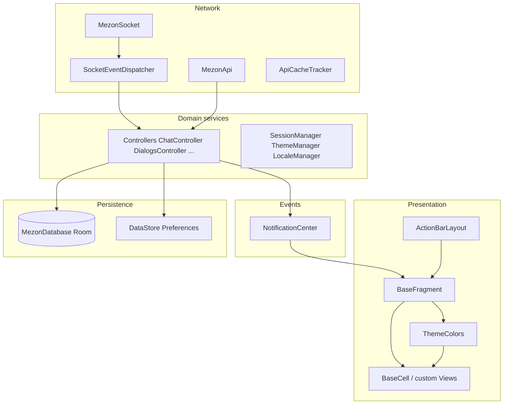

# Mezon Android — Architecture

This document describes how the production app is structured: modules, layers, navigation, data flow, and the main extension points. It reflects the codebase under `app/src/main/java/com/mezon/mobile/`.

## High-level characteristics

- **Telegram-style client**: Primary UI is custom `View` / `ViewGroup` (not Jetpack Compose for core chat chrome). Screens are `BaseFragment` subclasses managed by `ActionBarLayout` inside `MainActivity`, not the Navigation Component graph as the main shell.
- **Controller-centric state**: Domain and chat state live in Hilt `@Singleton` **controllers** with in-memory caches (`LongSparseArray`, lists, maps). **MVVM + per-screen `StateFlow` is not** the primary pattern for main surfaces.
- **Push-based UI updates**: Controllers emit **integer-keyed events** through `NotificationCenter`; fragments **observe** those IDs and refresh adapters or cells.
- **Dual path to persistence**: Network and WebSocket update controllers; **Room** stores a bounded/local projection. Writes to SQLite run off the main thread (`@IoDispatcher`); UI notifications are marshaled to the main thread.

---

## Gradle modules

| Module | Role |
|--------|------|
| `:app` | Android application: UI, controllers, DI, Room, networking glue. |
| `:core-proto` | Protobuf-generated **lite** Kotlin/Java for REST (`com.mezon.mezon.api.*`) and realtime (`com.mezon.mezon.rtapi.*`). Proto inputs are symlinked from the shared protocol repo (see `core-proto/build.gradle.kts`). |
| `:mmn-client-kotlin` | Additional Kotlin client library (included from root `settings.gradle.kts`). |

Root project name: **Mezon** (`settings.gradle.kts`).

---

## App entry and process lifecycle

- **`MezonApplication`** (`MezonApplication.kt`): `@HiltAndroidApp`; triggers Room warmup when a session exists; seeds `StartupCache` from DataStore for splash/theme/locale hints.
- **`MainActivity`** (`MainActivity.kt`): `@AndroidEntryPoint`; hosts **`ActionBarLayout`**, **`DrawerLayoutContainer`**, session/theme/locale wiring, connection state, deep links, and voice overlay. Implements `INavigationLayout.INavigationLayoutDelegate` and observes `NotificationCenter` for app-level events.
- **`MainTabsActivity`** and other activities: Secondary entry points (e.g. tab shell); fragments receive `inject(context)` from the hosting layout/activity when pushed.

---

## Layered view



---

## Presentation layer

### `BaseFragment` (`core/BaseFragment.kt`)

- **Not** `androidx.fragment.app.Fragment`. It is an abstract screen unit with its own lifecycle hooks (`onFragmentCreate`, `createView`, `onFragmentDestroy`).
- **Hilt**: Subclasses override `onInject(FragmentEntryPoint)` and use `entryPoint()` after the host has called **`inject(context)`** (see `ActionBarLayout`, `MainActivity`, `MainTabsActivity`).
- **`NotificationCenter`**: `observe(eventId) { … }` and `observeGlobal(eventId) { … }` register delegates; `onFragmentDestroy` removes them to avoid leaks.
- **Chrome**: `wrapWithActionBar(title, content)` builds a vertical `LinearLayout` with `ActionBarView` and subscribes the bar to `NotificationCenter.themeChanged`.

### Custom cells and lists

- **`BaseCell`** (`core/BaseCell.kt`): Base type for dense, list-style rows; handles long-press/haptics, optional **RenderNode** caching (`drawCached`, `allowCaching`, `forceNotCacheNextFrame`, `updatedContent`).
- **`ThemeColors`** (`core/ThemeColors.kt`): `@Singleton` holder of shared `TextPaint` / `Paint` and palette indices; avoids per-frame allocations in `onDraw`.
- **`LayoutHelper`** (`core/LayoutHelper.kt`): `dp` / `sp` and linear/frame helpers used across fragments and cells.
- Additional reusable widgets live under `ui/cells/`; feature-specific views live next to their feature packages.

### Navigation

- **Stack**: `ActionBarLayout` pushes/pops `BaseFragment` instances and forwards lifecycle; `INavigationLayout` abstracts the container.
- **Routing**: Some `NavRoutes` / intents exist for specific flows; the **main chat/clan experience** is still stack-based over `BaseFragment`.

---

## Domain layer — controllers

Controllers are **`@Singleton`** types injected via Hilt. They typically:

- Own **mutable in-memory caches** synchronized where needed.
- Call **`MezonApi`** for REST (protobuf Kotlin DSL request builders from `:core-proto`).
- Subscribe to **`SocketEventDispatcher`** `SharedFlow`s (see `ChatController` `init` blocks).
- Read/write **Room** via DAOs on **`@IoDispatcher`**.
- Post **`NotificationCenter.postNotificationOnMainThread`** (or related helpers) after state changes that the UI should reflect.

Representative types (non-exhaustive):

- **Chat & dialogs**: `ChatController`, `DialogsController`, `MessagesController`, `PinMessageController`, …
- **Clans & channels**: `ClansController`, `ChannelController`, `UserClanController`, `ChannelAppController`, …
- **Profile & social**: `UserController`, `AccountController`, `FriendController`, `DeviceController`, …
- **Realtime extras**: `VoiceController`, `ConnectionController`, `EmojiController`, …

**`FragmentEntryPoint`** (`di/FragmentEntryPoint.kt`) is the **narrow API** from `BaseFragment` subclasses to these singletons (and dispatchers/scopes), keeping fragments free of constructor injection.

---

## Event bus — `NotificationCenter` (`core/NotificationCenter.kt`)

- **Per-account instances**: `NotificationCenter.getInstance(account)` with `MAX_ACCOUNT_COUNT = 4`.
- **Global bus**: `NotificationCenter.getGlobalInstance()` for cross-account or app-global signals.
- **Event IDs**: `companion object` values assigned via `nextId()` (monotonic integers). Examples include `messagesDidLoad`, `messageDidUpdate`, `dialogsNeedReload`, `themeChanged`, `connectionStateChanged`, etc.
- **Observers**: Implement `NotificationCenterDelegate.didReceivedNotification(id, account, vararg args)`; UI code registers with `addObserver` (wrapped by `BaseFragment.observe`).

New features should **add one new ID per logical event** in this companion rather than reusing unrelated IDs with ad-hoc payloads.

---

## Data persistence

### Room (`data/db/`)

- **`MezonDatabase`**: WAL journal mode (`DatabaseModule`), version and entities defined in `MezonDatabase.kt`.
- **Entities** (current): `MessageEntity`, `DirectMessage`, `ClanEntity`, `ClanChannelEntity`, `NotificationEntity`, `FavoriteChannelEntity`, `ChannelAppEntity` (see `@Database` annotation).
- **DAOs**: `MessageDao`, `DirectMessageDao`, `ClanDao`, `ClanChannelDao`, `NotificationDao`, `FavoriteChannelDao`, `ChannelAppDao` — exposed through `DatabaseModule` providers.

Controllers are responsible for **bounded queries** (e.g. capped message windows per channel) where the product requires offline-first or fast cold display.

### DataStore

- **Session and preferences**: `AppModule` provides a `DataStore<Preferences>` (`mezon_session`). `SessionManager` and related types own token, API base URL, and user-visible settings flows.

---

## Network layer

### REST — `MezonApi` (`network/MezonApi.kt`)

- Large façade over generated **`com.mezon.mezon.api.*`** types; methods take `apiUrl`, `token`, and proto builders.
- Callers typically run inside `SessionManager.withAutoRefresh` or equivalent session-aware coroutine boundaries.

### WebSocket — `MezonSocket` (`network/MezonSocket.kt`)

- OkHttp **WebSocket**; protobuf **`Envelope`** framing with `com.mezon.mezon.rtapi.*` payloads.
- Handles reconnect, heartbeats, join/leave chat/clan, and outbound helpers (`channelMessageSend`, `markAsRead`, voice/WebRTC forwarding, etc.).

### `SocketEventDispatcher` (`network/SocketEventDispatcher.kt`)

- **`@Singleton`** demultiplexer: parses inbound `Envelope` traffic from `MezonSocket` and exposes **typed `SharedFlow`s** (`channelMessages`, `typingEvents`, `messageReactions`, `lastSeenMessageEvents`, …).
- **Controllers must not** re-parse raw envelopes for event types already exposed here — collect the appropriate flow under `@ApplicationScope` to avoid duplicate logic.

### `ApiCacheTracker` (`network/ApiCacheTracker.kt`)

- Coalesces **duplicate REST** attempts in hot paths (pattern integrated in controllers such as `ChatController.loadMessages`). Prefer extending this mechanism over one-off process-wide caches that fight eviction rules.

### Other

- **`NetworkMonitor`**: Connectivity signals for offline-first branches.
- **Ktor `HttpClient`**: Provided in `AppModule` for components that use Ktor (alongside OkHttp for WebSocket).

---

## Dependency injection (Hilt)

| Piece | Location |
|-------|----------|
| Application | `MezonApplication` — `@HiltAndroidApp` |
| Singleton module | `di/AppModule.kt` — dispatchers, `@ApplicationScope`, DataStore, `NotificationCenter.getInstance(0)`, OkHttp, Ktor client |
| Database | `di/DatabaseModule.kt` — `MezonDatabase`, DAOs |
| Qualifiers | `di/CoroutineDispatchers.kt` — `@IoDispatcher`, `@MainDispatcher`; `@ApplicationScope` scope type |
| Fragment access | `di/FragmentEntryPoint.kt` — explicit accessors for controllers and dispatchers |

**Note:** `provideNotificationCenter()` binds account **0** for default Hilt injection; multi-account code paths use `NotificationCenter.getInstance(account)` directly where needed.

---

## Session, theme, and locale

- **`SessionManager`**: Auth session, API URL, token refresh; surfaces `Flow`s consumed by controllers and UI gates.
- **`ThemeManager`** / **`ThemeColors`**: Theme mode resolution; `NotificationCenter.themeChanged` notifies fragments and action bars.
- **`LocaleManager`**: Language configuration; coordinates with `NotificationCenter.languageChanged` where applicable.
- **`AutoNightConfig`**: Scheduled night theme behavior (wired from `MainActivity`).

---

## Authentication and push

- **`auth/`**: Login/OTP fragments (`LoginFragment`, `OTPVerificationFragment`) and **`AuthRepository`** for credential exchange; still integrated with `BaseFragment` + stack navigation.
- **`notification/`**: FCM (`MezonFirebaseService`), **`FcmRepository`**, and in-app notification helpers (`NotificationHelper`) alongside `NotificationStore` / `NotificationEntity` persistence.

---

## How to extend the app safely

1. **New screen**: Add a `BaseFragment` subclass, implement `onInject`, register `observe` in `onFragmentCreate`, build hierarchy in `createView`; use `wrapWithActionBar` when you need standard top chrome.
2. **New feature state**: Prefer a **`@Singleton` controller** (or extend an existing one), add **Room** only if persistence is required, expose **`NotificationCenter`** events for UI.
3. **New realtime behavior**: Extend **`SocketEventDispatcher`** and **`MezonSocket`** only if a new envelope type needs parsing; otherwise consume existing flows from a controller.
4. **New REST surface**: Add/extend **`MezonApi`** methods aligned with `:core-proto` generated types; respect **`ApiCacheTracker`** for list-heavy endpoints.

For AI-assisted edits, the repository also maintains **Cursor/Claude rules** and **skills** (data flow, UI, naming) that restate constraints for agents; this document is the human-readable map of the same architecture.

---

## Directory map (abbreviated)

```
com.mezon.mobile/
├── MainActivity.kt, MezonApplication.kt
├── auth/
├── core/           # BaseFragment, BaseCell, ActionBarLayout, NotificationCenter, ThemeColors, LayoutHelper, …
├── data/db/        # Room database, DAOs, entities declared on database
├── di/             # Hilt modules, FragmentEntryPoint, qualifiers
├── home/           # Chat, clans, dialogs, voice, wallet, profile, friends, … + *Controller.kt
├── network/        # MezonApi, MezonSocket, SocketEventDispatcher, ApiCacheTracker, …
├── notification/
├── session/        # SessionManager, ThemeManager, LocaleManager, …
├── ui/             # Shared cells, theme helpers
├── util/
└── wallet/
```

Generated API types are referenced as **`com.mezon.mezon.api.*`** (REST) and **`com.mezon.mezon.rtapi.*`** (realtime) from the `:core-proto` module.
